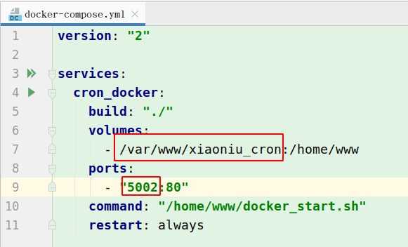
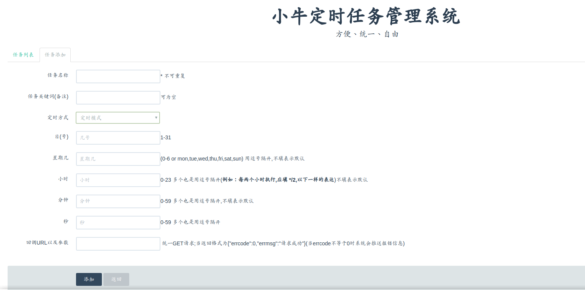
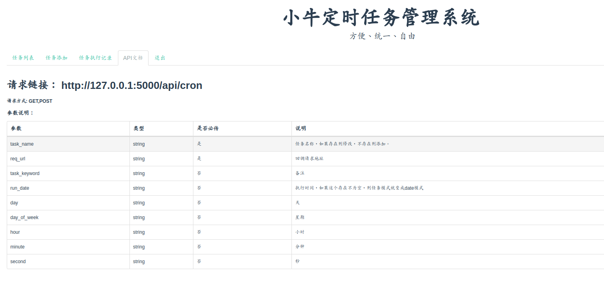
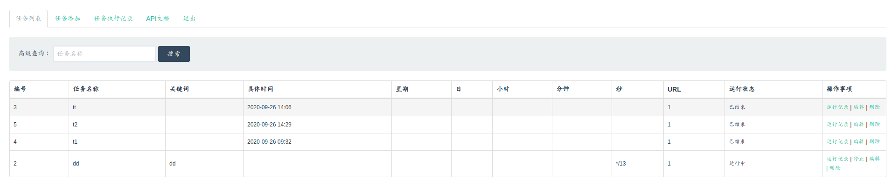

# 小牛定时任务管理（xiaoniu_cron）


### 特性

* 支持集群

* 可视化界面操作

* 定时任务统一管理

* 支持API动态调用

* 完全兼容Crontab

* 支持秒级定时任务

* 任务可搜索、暂停、编辑、删除

* 支持查看日志

* BUG及时通知

* Docker 一键安装，方便使用

[体验地址](http://cron_demo.aniulee.com/ "体验地址") 密码：123456

大家有什么问题，或者更好的建议可以加群：[730929995](https://jq.qq.com/?_wv=1027&k=6ovCipI9) 交流交流！
或者 [问题反馈](https://support.qq.com/products/284784 "问题反馈")

### 更新记录

#### 2022-01-27

提前祝大家新年快乐！

* 新增web_hook错误通知


新增开源项目（欢迎star）

[小牛简易socketio推送服务](https://github.com/aniu-lee/xiaoniu_socketio_server "小牛简易socketio推送服务")

#### 2021-11-15

最近有点忙，更新慢。感谢大家的支持！

* 优化上个版本遗留的bug。
* 新增`企业微信通知`，有错误就会及时通知。
* 新增回调接口签名，使API更安全。

#### 2021-02-22

提前祝大家元宵节快乐！！

* 优化分布式，如果有人需要用分布式的话，最好用此版本。
* 增加`上传实时执行记录`，方便用户查看该任务更详细情况。比如定时任务调用的是一个长时间的操作（通常会加异步去处理），这时候就需要上传任务更详细的执行的情况。
* 页面优化。
* 增加数据库更新命令

#### 2020-12-30

提前祝大家新年快乐，元旦快乐！！

* Python环境由原来3.5调整为3.6。
* 服务用supervisor来维护。
* 增加日志系统，存放于datas/logs目录下。

#### 2020-10-28

* 新增回调返回错误关键词自定义(配置可修改)
* 新增WEB管理任务，任务记录批量删除
* 优化定时任务异常报错，增加异常捕获
* docker配置修改，使其更精简

新增开源项目（欢迎star）

[小牛异步队列任务系统](https://github.com/aniu-lee/xiaoniu_tasks "小牛异步队列任务系统")

#### 2020-09-30

祝大家国庆节快乐！！

* 新增API-开启与关闭任务
* 增加定时删除job记录，默认保留1000条记录(配置可修改)
* API增加access_token,使API更健壮。(配置可修改)
* 网页：增加记录删除功能
* README更新


### 一、基本配置(conf.ini 文件)

从 `conf.example.ini` 拷贝一份 命名为 `conf.ini` 进行修改配置


### 二、修改docker-compose.yml 文件
1. 项目地址
2. 端口号

[]()

### 三、docker 一键安装

```shell script
sudo docker-compose up --build -d
```

具体docker,docker-compose怎么安装，自行谷歌，百度。

https://www.aniulee.com/#/details?id=286

### 四、开始使用

> 访问链接 http://{ip}:{docker-compose.yml设置的端口}

### 五、更新数据库命令

`sudo docker exec -it {容器ID} /bin/bash -c 'cd /home/www && python3.6 manage.py db migrate -m "upgrade" && python3.6 manage.py db upgrade'` 

* 添加定时任务

[]()

[]()

* 通过api调用 

[]()

* 定时任务列表

[]()

### 五、简单例子

* 每个月20号提醒我还花呗

* 每天凌晨2点清理垃圾

。。。

[更多例子设置参考](https://www.aniulee.com/#/details?id=260 "更多例子")

### 六、问题反馈

[问题反馈](https://support.qq.com/products/284784 "问题反馈")

QQ群：[730929995](https://jq.qq.com/?_wv=1027&k=6ovCipI9)

### 七、关于本人

[aniulee博客](https://www.aniulee.com "aniulee博客")

[小牛异步队列任务系统](https://github.com/aniu-lee/xiaoniu_tasks "小牛异步队列任务系统")

[两分钟内实现实时推送](https://www.aniulee.com/#/wx_push_setting "两分钟内实现实时推送")


#### 如果感觉项目还不错，有帮到您，来颗星，感谢！

#### 开源不易，欢迎大佬赏杯茶。
[]()
